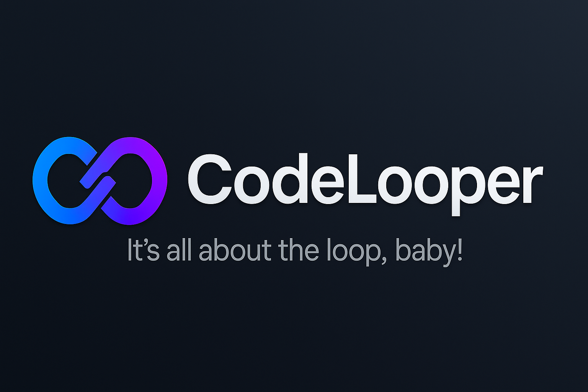
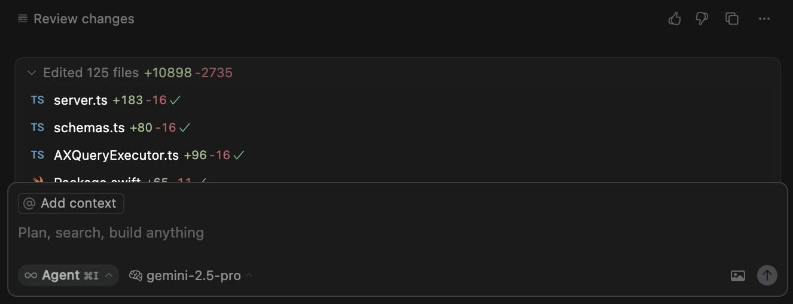
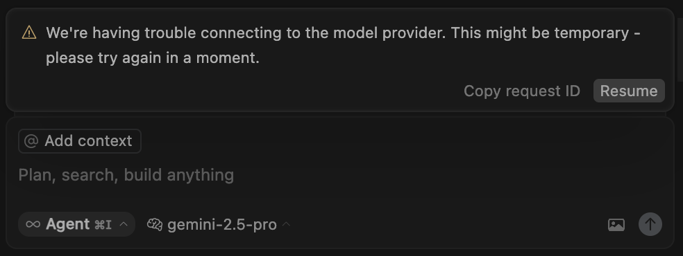

# CodeLooper 🔄

  

**A macOS menubar app that keeps your agents working in Cursor** 🔄

CodeLooper is a native macOS application that sits in your menubar, checking the the status of each Cursor window.
When Cursor breaks out of its productive loop – getting stuck generating code, dropping connections, or hitting errors – CodeLooper loops back in to restore the flow using macOS accessibility APIs:

It resolves these situations:

- **Plain Stop:** Cursor just stops, even though the text indicates that there's more to do. 
  

- **Connection Issues**: "We're having trouble connecting to the model provider." 
  

- **Stop after 25 Loops**: It automatically presses resume. 
  

## Automatic MCP Installation

CodeLooper can install various MCP's that help Cursor to build with fewer manual interventions:

- 👻 [Peekaboo](https://github.com/steipete/Peekaboo): Enables your IDE to make screenshots and ask questions about images.
- 🤖 [Terminator](https://github.com/steipete/Terminator): Manages a Terminal outside of the loop, so processes that might get stuck don't break the loop.
- 🧠 [Claude Code](https://github.com/steipete/claude-code-mcp): A buddy for your IDE that your agent can ask if he's stuck. Can do coding task and offer "a pair of fresh eyes" that often un-stucks the loop.
- 🐱 [Conduit](https://github.com/steipete/conduit-mcp): Advanced file manipulation for faster refactoring.
- 🎯 [Automator](https://github.com/steipete/macos-automator-mcp): AppleScript for your IDE.

Warning: These tools give your agent full power over your system, so integrate at your own risk.

## System Requirements

- **macOS Version**: macOS 14 (Sonoma) or later
- **Architecture**: Universal Binary (Apple Silicon and Intel)
- **Accessibility**: Requires accessibility permissions for IDE automation

### Getting Started

Download one of the releases from GitHub's Release section.

Note: This is currently under active development and doesn't yet work.
